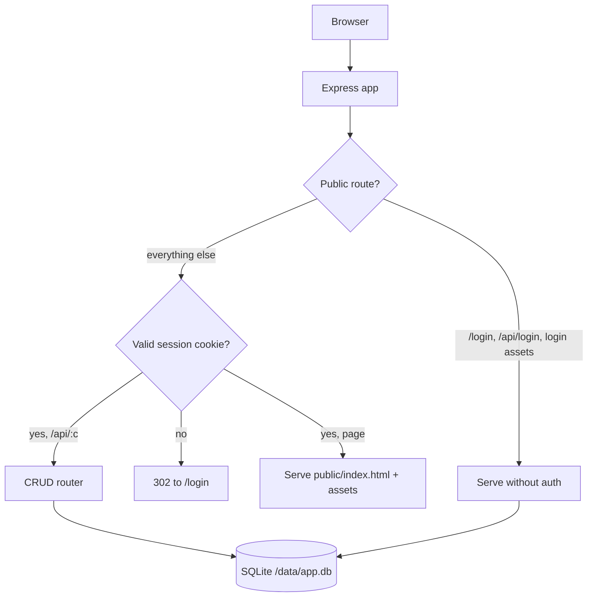
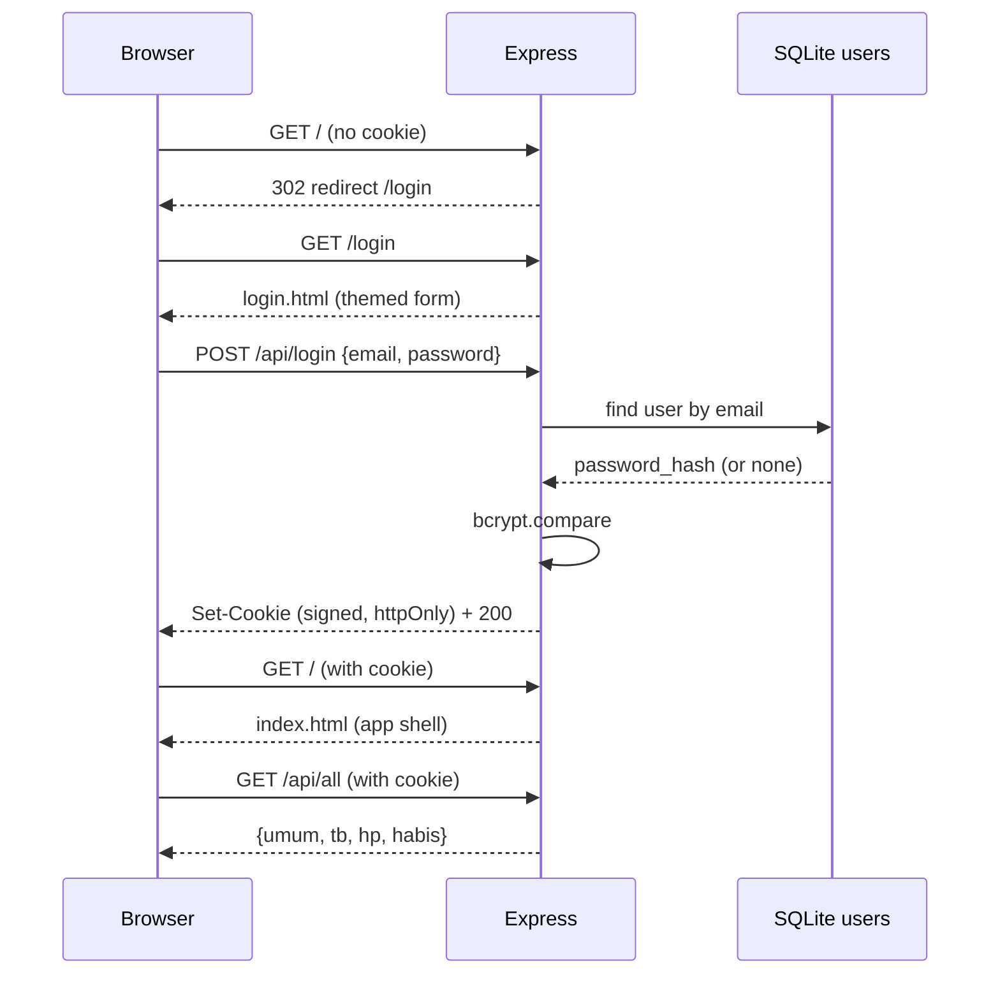

# Seefluencer Asset Management Fullstack - Plan

## Goal Capsule

- **Objective:** Convert the single-file HRGA Asset Management app (`index.html`) from browser-`localStorage` storage into a small Node/Express + SQLite fullstack with a database-backed login form and a light corporate re-theme, shippable as one Docker image to a plain VPS or Dokploy.
- **Authority:** This plan plus repo conventions. User preferences and explicit instructions override the plan.
- **Execution profile:** Standard feature build, sequential units, single deployable artifact.
- **Stop conditions:** All units complete; verification gates pass (data persists across container restart, auth gates the whole app via a login form, CRUD works per-record, theme applied, Docker image builds and runs); no dead image-upload code left behind.
- **Tail ownership:** Open a PR from the feature branch to a target branch confirmed with the developer at commit time.

---

## Product Contract

### Summary

Convert the asset-management app from browser-local storage to a Node/Express + SQLite fullstack so HR staff share one persistent dataset, gate the whole app behind a database-backed login form, repaint the UI from dark/gold to a light corporate palette on brand `#003c7d` + white, drop photo uploads in favor of emoji/icon, and ship as one Docker image that runs on a plain VPS or Dokploy with the database on a persistent volume.

### Problem Frame

The app stores all data in `localStorage` (`index.html:169,172,179`), so hosting it on a server yields a shared URL but **not** shared data — each browser keeps its own copy and clearing cache loses it. There is no access control, and a code scan confirmed there is no spreadsheet or external-API integration: the only outbound path is a client-side CSV download (`index.html:258`). HR wants to host the tool (VPS/Dokploy) for team use, which requires three things the current build lacks: shared server-side persistence, an authentication gate for confidential data, and a deployment artifact. Separately, the current dark theme should become a light, minimal, corporate look on the company brand color.

### Requirements

Data & persistence:
- R1. All asset data (general assets, immovable, IP, consumables) persists server-side in SQLite, shared across browsers and devices, replacing `localStorage`.
- R2. Each record is individually addressable (row-level create/update/delete) so a single edit never rewrites the whole dataset.
- R3. On first run against an empty database, the existing 142 general-asset seed records plus the immovable, IP, and consumable seeds load automatically.
- R4. Data survives container restart and redeploy via a persistent volume.

Authentication:
- R5. The entire app (UI and API) is gated; an unauthenticated request is redirected to the login page or rejected.
- R6. Login is a styled form (email + password) matching the new theme — not a browser-native Basic Auth dialog.
- R7. A default account is seeded on first run with a bcrypt-hashed password; the seed email and password are overridable via environment variables.
- R8. A session is held in a signed, httpOnly cookie, and a logout action ends it.

UI & theme:
- R9. The color system switches from dark (black + gold) to a light corporate palette built on brand `#003c7d` + white, applied through the `:root` tokens (`index.html:8`) plus the three hardcoded color stragglers (`index.html:29,30,64`), with WCAG-safe text contrast.
- R10. Photo / base64 image upload is removed; assets render emoji/icon only.
- R11. Existing behavior keeps working against server-backed data: 6 modules, search/filter, CSV export, print report, and maintenance scheduling.

Deployment:
- R12. The app ships as one Docker image (`node:20-bookworm-slim`) that builds the `better-sqlite3` native module reliably.
- R13. It deploys on a plain VPS (`docker run` with a volume) and on Dokploy (Dockerfile Application type + named volume), with the database under `/data` and writable by the container.
- R14. A README documents deploy steps for both VPS and Dokploy plus the environment variables.

### Scope Boundaries

#### Deferred to Follow-Up Work
- File-based photo upload/storage (e.g. `/data/uploads` + served URLs).
- Google Sheets sync or export-to-Sheets (CSV export already covers the spreadsheet view).
- Migration to PostgreSQL (revisit only if scale or concurrent writers grow materially).
- Multi-user roles / permissions (v1 ships a single seeded account).
- Server-side pagination, filtering, and search (the client currently loads all records at once — fine for low thousands, revisit if the dataset grows much larger).

#### Outside This Product's Identity
- Not a recruitment system despite the repo name `recruitment-sf`; it is an HRGA asset-management tool.
- Not a public-facing app; it is an internal team tool.
- HTTPS/TLS and domain routing are handled by the reverse proxy in front (Dokploy's Traefik, or nginx/Caddy on a plain VPS), not by the app — the app speaks plain HTTP on its port.

---

## Planning Contract

### Key Technical Decisions

- KTD1. **Stack = Node + Express + better-sqlite3.** Synchronous, minimal, single language with the existing frontend; tiny image; no ORM. `better-sqlite3` is the only native module.
- KTD2. **Schema = row-per-record + JSON `data` column.** One table per collection (`umum`, `tb`, `hp`, `habis`), each `id INTEGER PRIMARY KEY AUTOINCREMENT` + `data TEXT`. Matches the varied, sometimes-nested JS object shapes without rigid columns, gives row-level CRUD with server-assigned ids, and scales to thousands of rows. Rejected the whole-array blob approach (last-write-wins clobber + heavy payloads on every save). Filtering stays client-side, as today. Honest limit: SQLite scales fine, but the frontend loads every record via `GET /api/all` and filters in memory — that client-side load-all is the real scaling ceiling, not the database (server-side pagination/filtering is deferred; see Scope Boundaries).
- KTD3. **Auth = DB-backed login form + signed httpOnly session cookie + bcrypt.** A `users` table, `cookie-session` for a stateless signed cookie (survives restart, no session store), and `bcryptjs` (pure JS — avoids a second native module). This delivers the styled login form the user wanted with real server-side protection; it reverses the earlier Basic Auth lean now that a backend and DB exist.
- KTD4. **Seeded default account, env-overridable.** Seed one account on first run (`AUTH_SEED_EMAIL` / `AUTH_SEED_PASSWORD`, with documented defaults). Predictable access for HR, changeable without editing code.
- KTD5. **Photos dropped → emoji/icon only.** Removes base64 bloat and image plumbing; the frontend already renders an emoji fallback everywhere (`thumb`, `bigImg`, grid/table render paths).
- KTD6. **Re-theme via `:root` tokens + 3 stragglers.** The design is 100% token-driven, so rewriting `index.html:8` plus the three hardcoded values re-skins all 6 modules, modals, charts, and badges. Low blast radius.
- KTD7. **Docker = `node:20-bookworm-slim`, multi-stage.** The deps stage installs `python3 make g++` for the `better-sqlite3` native build (Debian/glibc gets prebuilt binaries more reliably than Alpine/musl). The container runs as **root** so the root-owned mounted volume at `/data` is writable — a documented Dokploy gotcha where a non-root container fails SQLite writes silently. `DB_PATH=/data/app.db`, WAL journal mode.
- KTD8. **Move `index.html` → `public/`** and serve it via Express static behind the auth middleware; refactor the data layer from `localStorage` to `fetch`.

### High-Level Technical Design

Request lifecycle and auth gate:

Login sequence:

### Assumptions
- Package manager for this Node project is **npm** (the Dockerfile uses `npm ci` with `package-lock.json`); a developer may use pnpm locally, but the committed lockfile is npm's.
- In front of the app, Dokploy's Traefik (or a VPS reverse proxy) terminates TLS and routes the domain; the app only needs to listen on `PORT` over HTTP.
- A `COOKIE_SECRET` env var signs the session cookie; if unset, the server falls back to a generated value at boot and logs a warning (sessions reset on restart until a stable secret is set).

---

## Implementation Units

### U1. Project scaffold and configuration

- **Goal:** Stand up the Node project skeleton, dependencies, and ignore/example files.
- **Requirements:** R1, R12, R14
- **Dependencies:** none
- **Files:** `package.json`, `package-lock.json` (generated), `.gitignore`, `.dockerignore`, `.env.example`
- **Approach:** Declare deps `express`, `better-sqlite3`, `cookie-session`, `bcryptjs`; a `start` script (`node server/server.js`); engines `node >=20`. `.gitignore` excludes `node_modules`, `*.db`, `*.db-wal`, `*.db-shm`, `.env`. `.dockerignore` excludes `node_modules`, `.git`, `*.db*`, `docs`, `.claude`. `.env.example` lists `PORT`, `DB_PATH`, `COOKIE_SECRET`, `AUTH_SEED_EMAIL`, `AUTH_SEED_PASSWORD`, `NODE_ENV` with safe placeholder values.
- **Test scenarios:** Test expectation: none — scaffolding/config only; validated indirectly when the server boots in U5.
- **Verification:** `npm install` completes and compiles `better-sqlite3` locally.

### U2. Seed data module (emoji-only)

- **Goal:** Extract the existing seed records into a reusable module, stripped of image data.
- **Requirements:** R3, R10
- **Dependencies:** U1
- **Files:** `server/seed.js`
- **Approach:** Move `SEED_UMUM` (142 records, `index.html:164`), `SEED_TB` (`:165`), `SEED_HP` (`:166`), and `SEED_HABIS` (`:167`) into a module exporting `{ umum, tb, hp, habis }`. Set every `image` field to `null` (emoji-only) and verify each record retains an `emoji`. Preserve all other fields verbatim, including nested `maintenance_schedule`.
- **Patterns to follow:** Keep the exact object shapes the frontend already consumes; do not rename keys.
- **Test scenarios:**
  - `umum` has 142 records; `tb`, `hp`, `habis` match the originals' counts.
  - Every record has `image === null` and a non-empty `emoji`.
  - A spot-checked record (e.g. the first general asset) keeps its `kode`, `harga_perolehan`, and `kategori` unchanged from `index.html`.
- **Verification:** Importing the module yields four arrays with the expected counts.

### U3. Database layer

- **Goal:** Initialize SQLite, define schema, seed on first run, and expose query helpers.
- **Requirements:** R1, R2, R3, R4, R7
- **Dependencies:** U1, U2
- **Files:** `server/db.js`, `server/db.test.js`
- **Approach:** Open `better-sqlite3` at `DB_PATH`, set `journal_mode = WAL`. `CREATE TABLE IF NOT EXISTS` for `umum`/`tb`/`hp`/`habis` (`id INTEGER PRIMARY KEY AUTOINCREMENT, data TEXT NOT NULL`) and `users` (`id`, `email UNIQUE`, `password_hash`, `created_at`). On boot: for each collection table that is empty, bulk-insert its seed rows inside a transaction; if `users` is empty, insert the seeded account using a bcrypt hash of `AUTH_SEED_PASSWORD` (or the documented default). If the effective password is still the documented default, log a loud startup warning to set `AUTH_SEED_PASSWORD` before real use. Export helpers: `listAll(collection)`, `create(collection, obj)` returning the row with its new `id`, `update(collection, id, obj)`, `remove(collection, id)`, and `findUserByEmail(email)`. Each helper parses/serializes the JSON `data` column and merges `id` into the returned object.
- **Patterns to follow:** Prepared statements and `db.transaction(...)` per better-sqlite3 docs; collection name is validated against an allowlist before use in SQL identifiers.
- **Execution note:** Start with `server/db.test.js` covering seed-once and CRUD round-trip against a temp DB file before wiring the server.
- **Test scenarios:**
  - Tables are created on first open against a fresh temp DB.
  - Seeding loads 142 `umum` rows plus the other collections when empty; re-opening the same DB does **not** duplicate seed rows.
  - The `users` table is seeded exactly once; `findUserByEmail` returns the account and `bcryptjs.compare` verifies the default/overridden password.
  - `create` returns the object with a server-assigned `id`; `update` mutates only the target row; `remove` deletes only the target row; `listAll` reflects each change.
  - An unknown collection name is rejected rather than interpolated into SQL.
- **Verification:** `node --test server/db.test.js` passes.

### U4. Auth module

- **Goal:** Provide credential verification, session configuration, and the gate middleware.
- **Requirements:** R5, R7, R8
- **Dependencies:** U3
- **Files:** `server/auth.js`, `server/auth.test.js`
- **Approach:** Export `cookieSession` config (signed with `COOKIE_SECRET`, `httpOnly`, `sameSite: 'lax'`, `secure` when `NODE_ENV=production` — the app sits behind a TLS-terminating proxy, so `server.js` sets `trust proxy` so the secure cookie is honored, reasonable `maxAge`), `verifyLogin(email, password)` (looks up the user, `bcryptjs.compare`), `requireAuth(req, res, next)` (passes when the session marks the user authenticated, otherwise 302→`/login` for page requests and 401 for `/api/*`), and `publicPaths` (the login page, login asset(s), and `POST /api/login`).
- **Test scenarios:**
  - `verifyLogin` returns truthy for the seeded credentials and falsy for a wrong password or unknown email.
  - `requireAuth` calls `next()` when the session is authenticated.
  - `requireAuth` issues a redirect for an unauthenticated page request and a 401 for an unauthenticated `/api/*` request.
  - Public paths bypass the gate.
- **Verification:** `node --test server/auth.test.js` passes.

### U5. Express server and CRUD API

- **Goal:** Wire the HTTP app: session, auth gate, static serving, and the data API.
- **Requirements:** R1, R2, R5, R8, R11
- **Dependencies:** U3, U4
- **Files:** `server/server.js`
- **Approach:** Create the Express app; set `trust proxy` (TLS terminates at the proxy in front); mount `express.json()` (the default body limit suffices now that records are emoji-only, not base64) and the cookie-session middleware; expose public routes (`GET /login` → `public/login.html`, `POST /api/login` → set session on success, `POST /api/logout` → clear session); apply `requireAuth` to everything else; serve `public/` statically behind the gate; mount the API: `GET /api/all` (aggregate of the four collections for init), `GET /api/:c`, `POST /api/:c`, `PUT /api/:c/:id`, `DELETE /api/:c/:id`, each validating `:c` against the allowlist. Listen on `PORT` (default 3000).
- **Patterns to follow:** Thin handlers delegating to `server/db.js`; consistent JSON error shape; the collection allowlist lives in one place shared with `db.js`.
- **Test scenarios:**
  - Covers R5. An unauthenticated `GET /` redirects to `/login`; an unauthenticated `GET /api/all` returns 401.
  - `POST /api/login` with seeded credentials sets a session cookie and returns success; with bad credentials returns 401 and no cookie.
  - With a valid session: `GET /api/all` returns all four collections; `POST /api/umum` creates and returns an object with an `id`; `PUT`/`DELETE` on that `id` persist; `GET /api/:c` reflects the change.
  - `POST /api/logout` clears the session so the next gated request redirects/401s.
  - An invalid collection name returns a 4xx rather than touching the DB.
- **Verification:** Manual or scripted run boots, seeds, and the login → `GET /api/all` flow returns 142 `umum` records.

### U6. Login page

- **Goal:** A themed login form that authenticates against the API.
- **Requirements:** R6, R9
- **Dependencies:** U5
- **Files:** `public/login.html`
- **Approach:** A single self-contained page using the new light corporate palette (brand `#003c7d` + white): centered card, email + password inputs, submit button, and an inline error area. On submit, `POST /api/login` as JSON; on success redirect to `/`; on failure show the error without leaving the page. No framework — inline CSS/JS to match the rest of the app.
- **Patterns to follow:** Reuse the new `:root` token values from U8 so the login screen and app share one palette.
- **Test scenarios:**
  - Submitting valid seeded credentials lands on the app at `/`.
  - Submitting invalid credentials shows an inline error and stays on `/login`.
  - Visiting `/login` while already authenticated still renders (or redirects to `/`) without error.
- **Verification:** Browser check: login form themed correctly, both success and failure paths behave.

### U7. Frontend data-layer refactor

- **Goal:** Replace `localStorage` with the server API and remove image upload.
- **Requirements:** R1, R2, R10, R11
- **Dependencies:** U5
- **Files:** `public/index.html` (moved from repo root)
- **Approach:** Move `index.html` to `public/`. Remove the `SK`/`localStorage` plumbing (`index.html:169,172,179`) and the global `save()`. `init()` calls `GET /api/all` and populates the in-memory arrays, then `renderAll()`. Convert the ~10 mutation sites — `saveAset`, `delAset`, `saveSvc`, `saveTB`, `saveHP`, `delHP`, `saveHabis`, `delHabis`, `restok` (and the edit path in `saveAset`) — to `fetch` POST/PUT/DELETE against `/api/:c`, using the server-returned `id` for new records (drop client-side `nid()` for creation). Remove image upload: the file input + `handleImg` + `addImgData`, and always render the emoji (drop the `a.image ?  : emoji` branches to emoji-only). Add a logout control (calls `POST /api/logout`, then redirects to `/login`) in the sidebar footer. Keep CSV export, print, filters, and maintenance scheduling operating on the in-memory arrays.
- **Patterns to follow:** Keep the existing render/structure; change only persistence and image handling. Keep optimistic local-array updates followed by the API call so the UI stays responsive.
- **Execution note:** Characterize current behavior first — note each `save()` call site and what it persists — before swapping in `fetch`, so no module loses persistence.
- **Test scenarios:**
  - Covers R1. After a hard reload (and from a second browser), previously created/edited/deleted assets reflect the server state, not a per-browser copy.
  - Covers R2. Creating an asset persists only that record; an edit in one module does not disturb others.
  - Adding/editing an asset shows the chosen emoji; there is no image-upload control anywhere.
  - CSV export, print report, search/filter, and "catat service" still work end-to-end.
  - Logout returns to `/login` and the app is no longer reachable without re-auth.
- **Verification:** Manual flow across two browsers confirms shared, persisted data and emoji-only rendering.

### U8. Light corporate re-theme

- **Goal:** Switch the palette from dark/gold to light corporate on brand `#003c7d`.
- **Requirements:** R9
- **Dependencies:** U7 (same file; sequence after the refactor to avoid churn)
- **Files:** `public/index.html`, `public/login.html`
- **Approach:** Rewrite the `:root` block (`index.html:8`) to the light palette: off-white-blue page, white surfaces, navy text, brand `#003c7d` accent with a light brand tint for active/badge backgrounds, and status colors deepened with light tint backgrounds for contrast. Fix the three stragglers: accent-button text → white (`index.html:29`), `btn-del`/`btn-warn` borders → light tints (`index.html:30`), and the modal scrim → a softer brand-tinted `rgba` (`index.html:64`). Ensure `login.html` shares the same tokens.
- **Patterns to follow:** Do not touch component CSS — the tokens drive everything. Keep the same variable names so all references resolve.
- **Test scenarios:** Test expectation: none (visual/style change). Validate by review against WCAG AA contrast for body text and badges on their tint backgrounds.
- **Verification:** Visual check across all 6 modules, modals, badges, and charts: light, minimal, corporate; no leftover dark backgrounds; readable contrast.

### U9. Dockerfile and deployment artifact

- **Goal:** Produce one image that builds `better-sqlite3` reliably and persists the DB on a volume.
- **Requirements:** R12, R13
- **Dependencies:** U5, U6, U7, U8
- **Files:** `Dockerfile`, `.dockerignore` (from U1, confirm contents)
- **Approach:** Multi-stage on `node:20-bookworm-slim`. Deps stage: install `python3 make g++`, `npm ci --omit=dev`. Runner stage: copy `node_modules`, `server/`, `public/`, `package.json`; `mkdir -p /data`; set `NODE_ENV=production DB_PATH=/data/app.db PORT=3000`; `EXPOSE 3000`; `CMD ["node","server/server.js"]`. Run as root (default) so a root-owned mounted `/data` is writable. The volume holds `app.db` and its WAL/SHM sidecars.
- **Test scenarios:** Test expectation: none (build artifact); validated by the build/run gates in Verification.
- **Verification:** `docker build` succeeds; `docker run -e COOKIE_SECRET=... -e AUTH_SEED_PASSWORD=... -v assetdata:/data -p 3000:3000` boots and seeds; data persists across `docker restart`.

### U10. README and deploy documentation

- **Goal:** Document running locally, on a VPS, and on Dokploy.
- **Requirements:** R14
- **Dependencies:** U9
- **Files:** `README.md`
- **Approach:** Cover: prerequisites; env vars (`PORT`, `DB_PATH`, `COOKIE_SECRET`, `AUTH_SEED_EMAIL`, `AUTH_SEED_PASSWORD`); local run (`npm install`, `npm start`); VPS via `docker run` with a named volume; Dokploy as a Dockerfile **Application** with a **named volume** mounted at `/data` (call out the root-owned-volume permission gotcha and that TLS/domain are handled by Traefik in front); default credentials and the instruction to change them on first deploy; backup = copy the `app.db` file (or use Dokploy's named-volume backup).
- **Test scenarios:** Test expectation: none (docs).
- **Verification:** A reader can deploy on both targets by following the README without guessing env vars or volume paths.

---

## Verification Contract

| Gate | Command / action | Proves | Applies to |
|---|---|---|---|
| Unit tests | `node --test` | DB seed-once + CRUD, auth verify + gate | U3, U4 |
| Install/build | `npm install` | `better-sqlite3` compiles | U1 |
| Boot + seed | `npm start` then `GET /api/all` after login | Seeds 142 `umum`; API returns shared data | U3, U5 |
| Auth gate | Unauth `GET /` → `/login`; bad login → 401; good login → app | Whole-app gating + login form | U4, U5, U6 |
| Persistence | Create record, `docker restart`, re-read | Data survives restart on the volume | U7, U9 |
| Cross-browser | Edit in browser A, reload browser B | Shared (not per-browser) data | U7 |
| Image removal | Inspect add/edit forms and rendering | Emoji-only, no upload control | U7, U8 |
| Theme | Visual review of all modules/modals/badges | Light corporate palette, readable contrast | U8 |
| Docker | `docker build` + `docker run -v … -p …` | Image builds and runs end-to-end | U9 |

---

## Definition of Done

Global:
- All units complete; `node --test` passes; the Docker image builds and runs.
- Login form gates the entire app; the seeded account logs in; logout works.
- Data is shared and persists across container restart (verified on a volume).
- UI is the light corporate theme on `#003c7d`; no leftover dark styling.
- Photo upload and base64/image plumbing are fully removed (no dead code), emoji/icon only.
- README documents VPS and Dokploy deploys plus env vars and default-credential change.

Per-unit: each unit's Verification line is satisfied before it is considered done.

Cleanup: remove any abandoned experiment code, the old root `index.html` once moved to `public/`, and any `localStorage`/`save()`/image-upload remnants.

---

## Risks & Dependencies

- **`better-sqlite3` native build.** Risk: build failure on the base image. Mitigation: `node:20-bookworm-slim` (glibc) + build toolchain in the deps stage; verified by the Docker build gate.
- **Volume permissions on Dokploy.** Risk: a root-owned mounted `/data` blocks writes and SQLite fails silently. Mitigation: run the container as root (KTD7); document the named-volume setup and the gotcha in the README.
- **Concurrency model.** Row-level CRUD + WAL handles a small HR team; there is no per-row optimistic locking, so two simultaneous edits to the *same* record are last-write-wins. Acceptable for v1; note it in the README.
- **Session secret.** Risk: unset `COOKIE_SECRET` resets sessions on restart. Mitigation: documented env var with a boot-time warning fallback.
- **Seed extraction fidelity.** Risk: mis-copying 142 records. Mitigation: copy arrays verbatim, only null the `image` fields, and assert counts in U3 tests.
- **Single-file move.** Moving `index.html` → `public/` changes the served path; the server's root route and static config must point at `public/`. Because `public/` is served behind the auth gate, the login page must be reachable via an explicit public `GET /login` route and stay fully self-contained (no externally-linked assets that the gate would 401).
- **Login brute-force / CSRF (defense-in-depth, deferred).** There is no login rate-limiting; for an internal single-account tool behind the proxy this is low risk, but noted. CSRF is mitigated by `sameSite: 'lax'` plus a JSON-only API rather than a CSRF token — acceptable for an internal tool; revisit if the app is exposed more widely.

---

## Sources & Research

- `index.html` — current app: `:root` tokens (`:8`), hardcoded color stragglers (`:29,30,64`), seed arrays (`:164-167`), persistence (`:169,172,179`), CSV export (`:258`); confirmed no spreadsheet/external-API integration.
- better-sqlite3 docs (Context7 `/wiselibs/better-sqlite3`) — WAL pragma (`journal_mode = WAL`), prepared statements, `db.transaction(...)`.
- Dokploy docs / community — Dockerfile Application deploys, named volumes for persistence and backups, and the root-owned-volume permission gotcha for SQLite; Traefik handles TLS/domain in front.
